# Définitions et concepts de base

La **visualisation de données** est une méthode permettant de représenter des données sous forme visuelle, comme des graphiques, des cartes ou des infographies, pour faciliter leur compréhension et leur analyse. Plutôt que de lire des lignes de chiffres ou des tableaux complexes, une visualisation bien conçue permet de **voir des tendances, des schémas** ou des anomalies en un coup d’œil.  
La **visualisation des données** est un ensemble de méthodes permettant de **résumer de manière graphique de données statistiques** qualitatives et surtout quantitatives afin de montrer les liens entre des ensembles de ces données.

## Avantage de la visualisation de données
1. **Facilite la compréhension** : Les humains traitent plus facilement les informations visuelles que les données brutes. Une bonne visualisation peut rendre des données complexes plus faciles à comprendre.
   - **Exemple** : Si vous regardez un tableau de chiffres représentant les températures moyennes dans différents départements, il serait difficile de remarquer une tendance. Cependant, une carte montrant ces températures sur une période permet de voir immédiatement les différences régionales.

   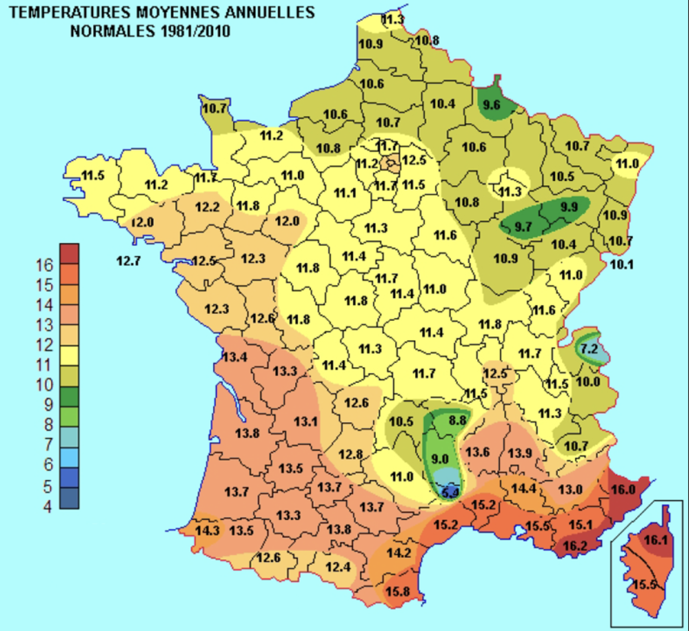

2. **Identification rapide des tendances et des relations** : En visualisant des données, vous pouvez plus facilement détecter des relations, des corrélations ou des tendances à long terme.
   - **Exemple** : Un histogramme ou un nuage de points permet de montrer des corrélations entre deux variables. Par exemple, une entreprise peut visualiser la relation entre la publicité et les ventes : plus la publicité augmente, plus les ventes augmentent aussi, ce qui peut indiquer une relation de cause à effet.

   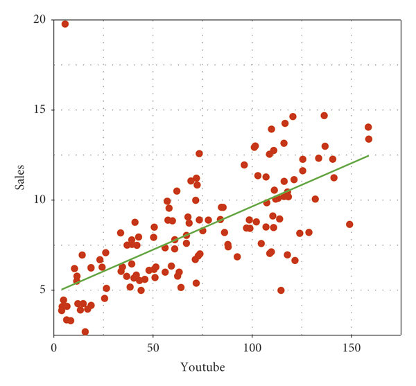

3. **Communication efficace** : Les visualisations facilitent la transmission d’informations complexes à un public varié. Elles sont particulièrement utiles pour présenter des résultats ou des recherches à des personnes qui n'ont pas l'habitude de traiter des données brutes.
   - **Exemple** : Lors d’une conférence sur le changement climatique, des cartes et des graphiques peuvent illustrer les zones touchées par la montée des eaux ou la hausse des températures, rendant les faits plus tangibles.

   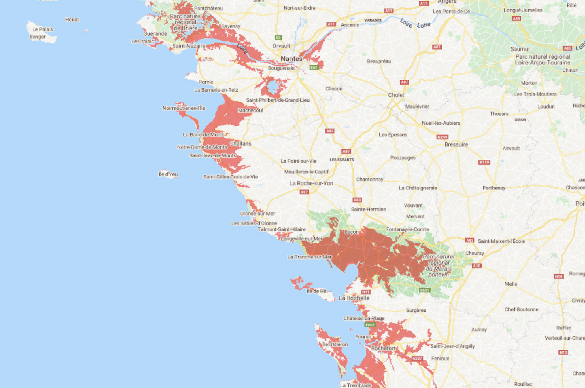

## Enjeu de la représentation 

L'idée peut sembler simple, il s'agit de passer d'un simple fichier csv à une représentation :

   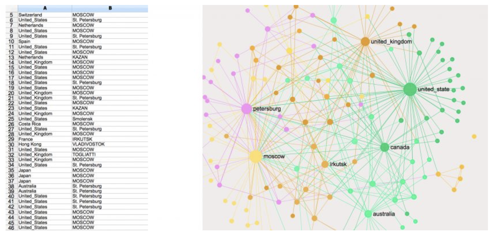

Sauf... qu'il y a un vrai défi derrière et rien n'est simple. Pourtant, la visualisation est essentielle.

### Quartet d'Anscombe
Le *quartet d'Anscombe* est constitué de **quatre ensembles de données** qui ont les **mêmes propriétés statistiques** simples mais qui sont en réalité très différents, ce qui se voit facilement lorsqu'on les représente sous forme de graphiques.  
 Ils ont été construits en 1973 par le statisticien Francis Anscombe dans le but de démontrer l'importance de tracer des graphiques avant d'analyser des données, car cela permet notamment d'estimer l'incidence des données aberrantes sur les différentes indices statistiques que l'on pourrait calculer.

| I (x) | I (y) | II (x) | II (y) | III (x) | III (y) | IV (x) | IV (y) |
|-------|-------|--------|--------|---------|---------|--------|--------|
| 10,0  | 8,04  | 10,0   | 9,14   | 10,0    | 7,46    | 8,0    | 6,58   |
| 8,0   | 6,95  | 8,0    | 8,14   | 8,0     | 6,77    | 8,0    | 5,76   |
| 13,0  | 7,58  | 13,0   | 8,74   | 13,0    | 12,74   | 8,0    | 7,71   |
| 9,0   | 8,81  | 9,0    | 8,77   | 9,0     | 7,11    | 8,0    | 8,84   |
| 11,0  | 8,33  | 11,0   | 9,26   | 11,0    | 7,81    | 8,0    | 8,47   |
| 14,0  | 9,96  | 14,0   | 8,10   | 14,0    | 8,84    | 8,0    | 7,04   |
| 6,0   | 7,24  | 6,0    | 6,13   | 6,0     | 6,08    | 8,0    | 5,25   |
| 4,0   | 4,26  | 4,0    | 3,10   | 4,0     | 5,39    | 19,0   | 12,50  |
| 12,0  | 10,84 | 12,0   | 9,13   | 12,0    | 8,15    | 8,0    | 5,56   |
| 7,0   | 4,82  | 7,0    | 7,26   | 7,0     | 6,42    | 8,0    | 7,91   |
| 5,0   | 5,68  | 5,0    | 4,74   | 5,0     | 5,73    | 8,0    | 6,89   |

Chaque ensemble de données contient 11 points. Les quatre ensembles présentent ces propriétés :

| Propriété                                        | Valeur   |
|--------------------------------------------------|----------|
| **Moyenne des x**                                | 9,0      |
| **Variance des x**                               | 10,0     |
| **Moyenne des y**                                | 7,5      |
| **Variance des y**                               | 3,75     |
| **Coefficient de corrélation entre les x et les y** | 0,816    |
| **Équation de la droite de régression linéaire** | y = 3 + 0,5x |
| **Somme des carrés des erreurs relativement à la moyenne** | 110,0    |

Mais ces quatre ensembles ont des **représentations graphiques** très différentes :  
 
   .png)

## Petit historique
*(en) Michael Friendly, « A Brief History of Data Visualization », dans Handbook of Data Visualization, 2008 (DOI 10.1007/978-3-540-33037-0_2)*

Dès l'apparition de l'écriture, on trouve des traces de données mises en liste ou tableau. Mais il ne s'agit pas encore de visualisaitons complexes. On pense que les premières cartes géographiques ou astronomiques remontent vers le VIIe millénaire avant notre ère ; pour les frises chronologiques, en revanche, il faut attendre. On ne peut pas les dater précisément, mais on en trouve au Xe siècle, dans le  **Commentaire au songe de Scipion** de Macrobe, par exemple.  

*Description du mouvement des planètes au cours du temps - Il s'agit d'un des premiers graphiques de série temporelle de l'histoire.*
   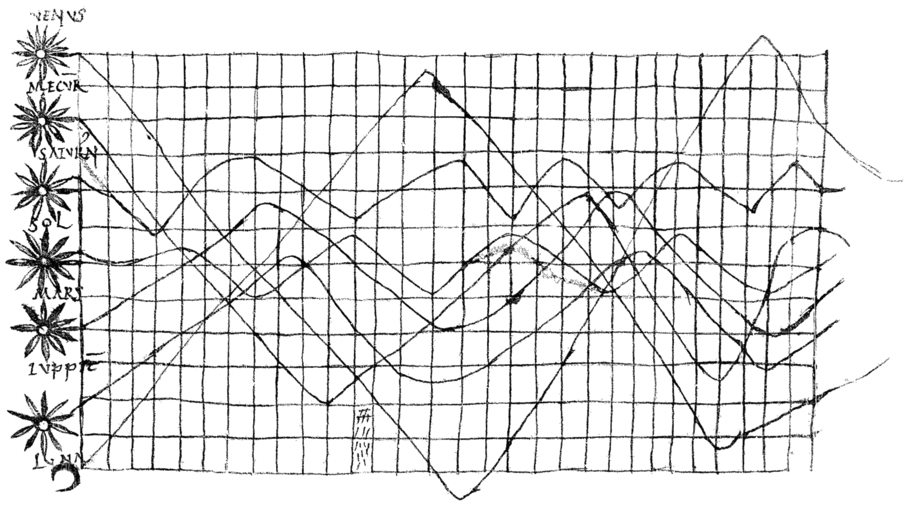

La visualisation de données naît au XVIIIe siècle, avec les travaux de **Charles-René de Fourcroy** et notamment de **William Playfair**.
- Charles-René de Fourcroy propose un "Tableau poléométrique" (1782) : il permet la comparaison instantanée de la taille des villes européennes.

   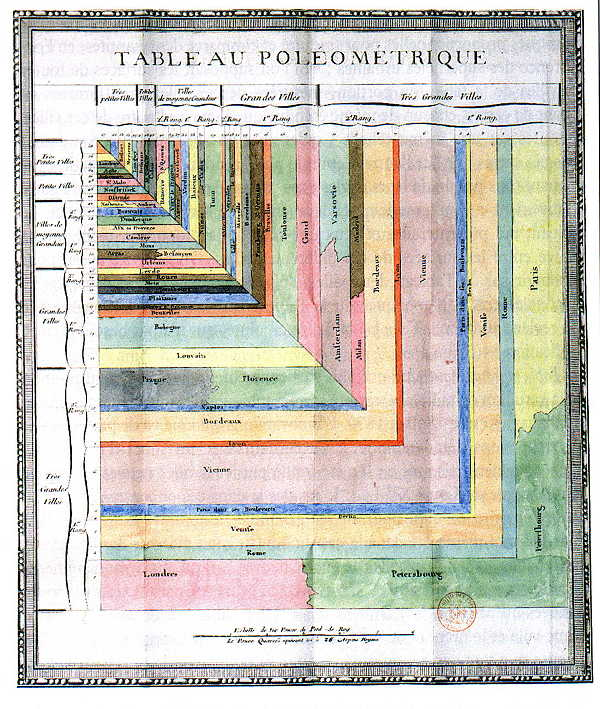
- August Friedrich Wilhelm Crome avec sa « Verhaeltniss Karte von den deutschen Bundesstaaten » (1785) qui permet la comparaison de la taille des pays.

   .jpg)

En 1786, William **Playfair** (1759-1823) publie un ouvrage intitulé *The Commercial and Political Atlas* qui fait date. Il y propose une série de graphiques de séries temporelles représentant **l'évolution de données économiques concernant l'Angleterre** et notamment l'évolution de sa balance commerciale au cours du XVIIIe siècle, ainsi que le premier **diagramme en bâtons** de l'histoire. C'est aussi à William Playfair que l'on doit le premier **graphique circulaire** connu. Publié en 1801 dans *The Statistical Breviary*, le graphique représente la superficie, le montant des revenus et le montant des taxes de chaque pays.
   
   .png)
   ![Les cercles représentent la superficie de chaque pays. Les lignes à gauche de chaque cercle représentent la population (en millions d'habitants) et les lignes à droite représentent le total des taxes collectées (en millions de livres sterling). La ligne pointillée met en relation la ligne des revenus et la ligne des taxes. Sa pente n'a pas d'interprétation mais le signe de la pente en a une. Le graphique montre qu'en Grande-Bretagne, le total des taxes comparé à la population est plus élevé que dans les autres pays.](ressources/playfair(3).jpg)

Dans les années 1820, on commence à représenter des **données statistiques sur une carte**. En 1826, **Charles Dupin** dessine une **carte choroplèthe** de l'instruction populaire en France, en coloriant les départements français en fonction de l'intensité de la variable représentée.
   

Cette représentation visuelle rencontre un rapide succès et est aussitôt reprise par **André-Michel Guerry et Adriano Balbi** qui dessinent des cartes choroplèthes de l'instruction, du nombre de crimes contre les propriétés et du nombre de crimes contre les personnes, puis par Guerry dans son *Essai sur la statistique morale de la France* publié en 1833.
   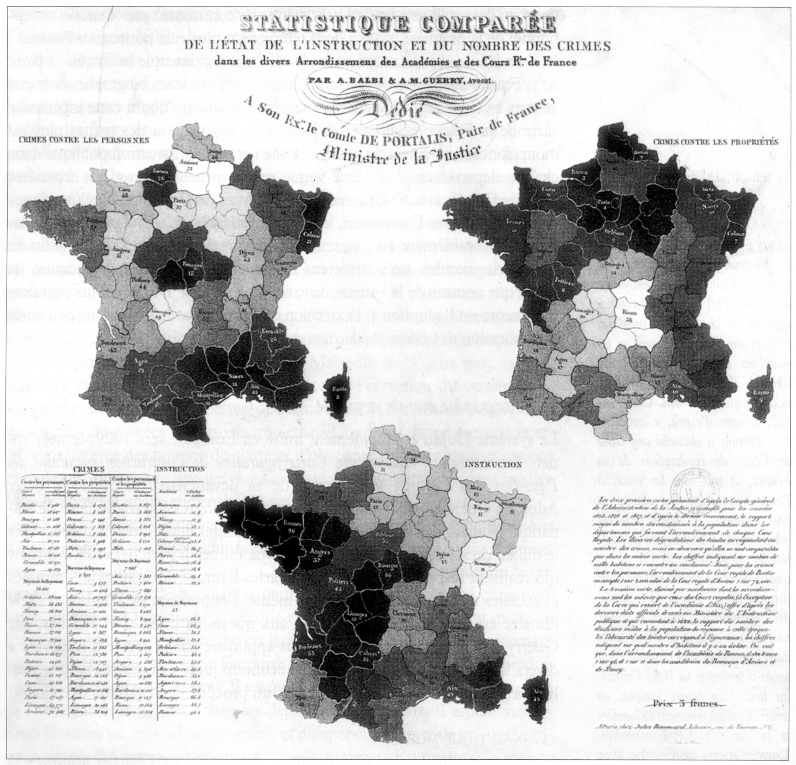

Peu de temps après, **Armand Joseph Frère de Montizon** propose la première « cartes par points » (dot map), avec une représentation de la population française par département intitulée ***Carte Philosophique figurant la Population de la France***.
   

En 1855, le médecin britannique **John Snow** établit une carte de points du **choléra à Londres** sur laquelle il représente la **localisation des morts et la localisation des points d'eau** dans la ville de Londres mettant ainsi en évidence le fait que l'épidémie se propage par l'eau. Cette découverte a amené des changements dans la santé publique avec, notamment, la construction d'installations sanitaires améliorées.
   
   .jpg)

En 1861, **Charles Joseph Minard** propose de représenter des données sur une carte à l'aide de diagrammes circulaires dont l'aire est proportionnelle à la quantité représentée.

   

Mais Minard est plus connu pour sa **Carte figurative des pertes successives en hommes de l’Armée française dans la campagne de Russie en 1812-1813**. Le graphique présente plusieurs variables dans une simple image en deux dimensions :
- localisation et itinéraire de l’armée indiquant les points de séparation et de regroupement des unités ;
- pertes humaines de l’armée (particulièrement sensibles lors de la traversée de la Bérézina) ;
- variations de la température de l’air au cours de la retraite.

   .png)

En 1857, **Florence Nightingale** publie son *Diagramme des causes de mortalité au sein de l'armée en Orient*. Le graphique montre que les soldats anglais engagés dans la **guerre de Crimée** meurent moins au combat face à l'ennemi qu'ils ne sont victimes des conditions sanitaires déplorables dans lesquelles ils vivent.

   

En 1889 **Charles Booth** combine approche ethnographique à grande échelle et visualisation sous forme cartographique, pour rendre compte des conditions de vie à Londres. Cette **étude sociologique**, une des plus importantes du genre, a mobilisé une équipe d'enquêteurs rémunérés par Booth afin de collecter des données au niveau de chaque parcelle cadastrale. La visualisation proposée par Booth détaille, par des couleurs, 7 "classes". 
Cette enquête avait une visée politique explicite : elle entendait fournir des données à même d'orienter rationnellement l'action publique en direction des pauvres, dans un contexte où les révoltes populaires du quartier de l'East End de Londres avaient placé la pauvreté urbaine au centre de l'attention des classes dirigeantes du pays.
   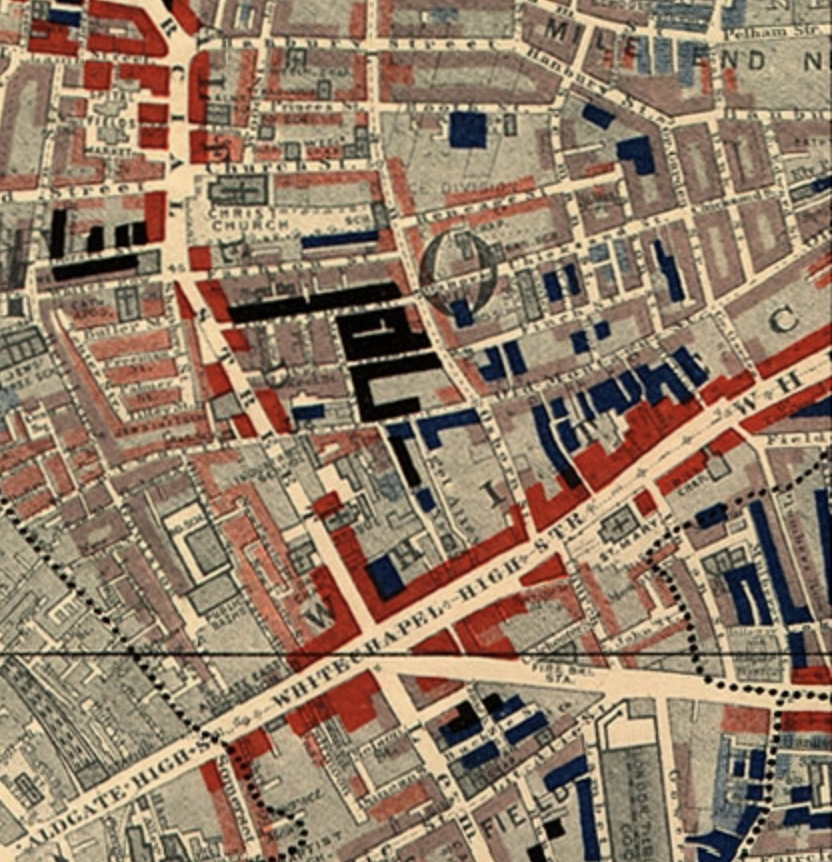

Au cours de la seconde moitié du XIXe siècle, on découvre plusieurs innovations importantes, comme les premières **visualisations en trois dimensions** de l'Italien **Luigi Perozzo**.
   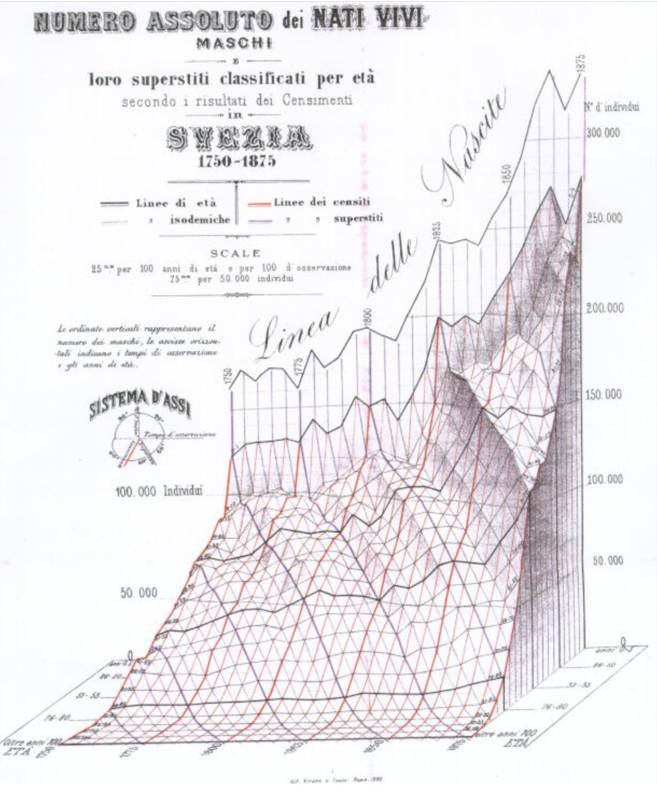

Au Royaume-Uni, **Francis Galton** fait une importante contribution à la visualisation de données en proposant des représentations graphiques de la **corrélation entre deux variables** (nuage de points) mais aussi des cartes météorologiques.
   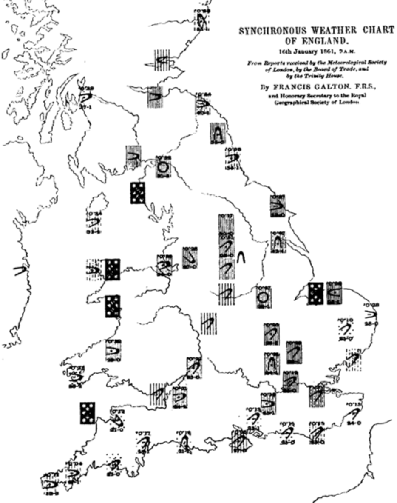

Au cours du premier XXe siècle, les statisticiens prêtent une moindre attention à la visualisation de données.   Il faut attendre les années 70 et le livre *Exploratory Data Analysis* de **John Tukey** pour qu'il y ait de nouvelles réflexions sur la visualisation des données. Il y présente entre-autres le principe de la **boîte à moustaches** (ou diagramme de quartiles) mais aussi les **diagrammes branche-et-feuille**, une variante des histogrammes.
   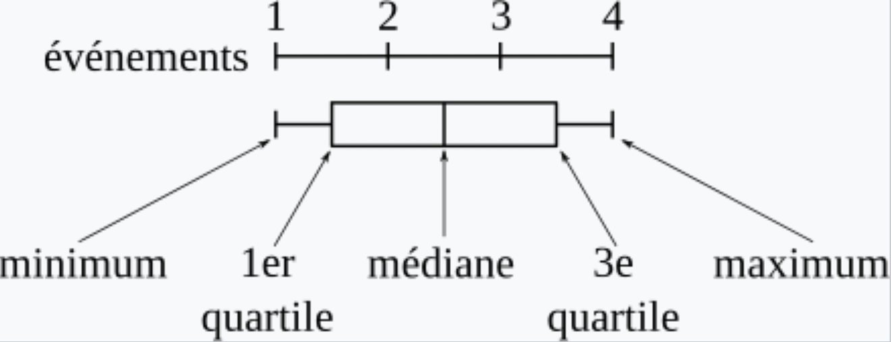
   .jpg)

Il n'y a plus de grandes nouveautés après cette date, mais les outils informatiques (avec lesquels nous allons travailler) changent la façon de procéder.   *~ 30 min*

## Quelles données?
À côté des données personnelles de la recherche, il existe les données publiques.  
- Création de l'Insee (Institut national de la statistique et des études économiques) : 1946  
Elles sont de plus en plus ouverte : 
- 1978 : dite “loi CADA” : création du droit d’accès aux documents administratifs
- 2003 : une directive du Parlement Européen et du Conseil sur la réutilisation des informations du secteur public (en 2005 dans le droit français : création du droit de réutiliser l’information publique)
- 2007 : Directive européenne INSPIRE : obligation de publier en open data les données environnementales et géographiques
- 2011 : création d’Etalab (une administration publique française qui vise à améliorer le service public et l'action publique grâce aux données). Etalab coordonne la stratégie de l'administration dans le domaine de la donnée : partage des données ouvertes ("open data"), circulation des données entre administrations, exploitation des données et intelligence artificielle.... 
- 2011 : data.gouv.fr, une plateforme de diffusion de données publiques (« open data ») de l'État français
- 2011 : data.bnf.fr, une base de données sémantique contenant des données sur les œuvres, les auteurs et les thèmes du catalogue de la Bibliothèque nationale de France (BNF).
- 2015 : loi relative à la gratuité et aux modalités de la réutilisation des informations du secteur public : création du droit de réutiliser librement les données publiques
- 2016 : loi pour une République numérique : consécration du principe de l’open data par défaut.
- 2019 : directive européenne sur les données ouvertes et la réutilisation des informations du secteur public : inclusion des données des entreprises investies d’une mission de service public dans le champ de l’open data.

## Formes, Usages et Types de données
**Data visualisation :**  
Les données sont traitées et transformées en visualisation en flux (la mise à jour des données influe sur la visualisation)
   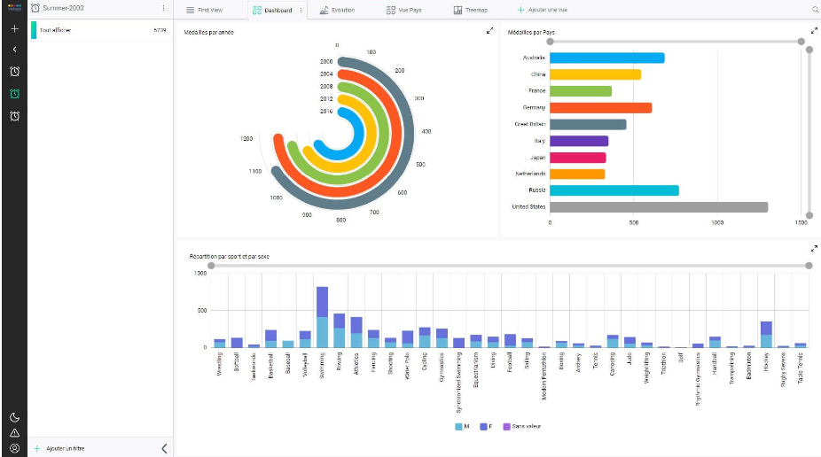

**Infographie :**  
Les données sont analysées, synthétisées et traduites en expression visuelle (la visualisation est plus “adaptée”)
   

**Visualisation directe**  
Exemple : Google Trends : https://trends.google.fr/trends/explore?geo=FR&q=donn%C3%A9es,data  
**Visualisation indirecte**
Exemple Atlas des mobilités : https://fr.boell.org/fr/2022/06/07/la-vitesse-au-point-mort

**Différents usages**  
Usages externes : Faire comprendre, Décrire et mettre en valeur une activité, Proposer une lecture des données  
Usage internes : Appréhender la masse, Analyser, Assurer un suivi (qualité), Permettre la prise de décision

**Exemples d'usage**  
Externe : Revue "En Mutation" : https://wedodata.fr/productions/mutations-infographies  
Interne : « Panama papers » : un défi technique pour le journalisme de données : https://www.lemonde.fr/blog/data/2016/04/08/panama-papers-un-defi-technique-pour-le-journalisme-de-donnees/ (La complexité des montages offshore, où plusieurs sociétés-écrans s’emboîtent comme des poupées russes, rendait très laborieux le travail pour remonter la piste des véritables bénéficiaires. L’ICIJ a donc mis à disposition des médias partenaires l’outil de visualisation en graphes Linkurious pour faciliter l’exploration de la base de données. Concrètement, cet outil faisait le lien entre quatre entités différentes contenues dans la partie « structurée » du « leak » : les sociétés, les intermédiaires, les actionnaires et leurs adresses. Il permettait de faire des recherches rapides et visuelles sur ces entités.)

**Quelles données?**  
Produits : Visualisation aux AN : https://www.elastic.co/fr/blog/la-visualisation-appliquee-aux-archives-avec-elasticsearch-et-kibana  
Activités : Sur la piste des œuvres antiques : https://ventesdantiques.inha.fr/story.php#fr/80461/creation  
Usages : Fréquentation des Musées de France : https://data.culture.gouv.fr/explore/dataset/frequentation-des-musees-de-france/analyze/?dataChart=eyJxdWVyaWVzIjpbeyJjaGFydHMiOlt7ImFsaWduTW9udGgiOnRydWUsInR5cGUiOiJsaW5lIiwiZnVuYyI6IlNVTSIsInlBeGlzIjoidG90YWwiLCJzY2llbnRpZmljRGlzcGxheSI6dHJ1ZSwiY29sb3IiOiIjYzQzYTJmIn0seyJhbGlnbk1vbnRoIjp0cnVlLCJ0eXBlIjoibGluZSIsImZ1bmMiOiJTVU0iLCJ5QXhpcyI6InBheWFudCIsInNjaWVudGlmaWNEaXNwbGF5Ijp0cnVlLCJjb2xvciI6IiMzNzdkODcifSx7ImFsaWduTW9udGgiOnRydWUsInR5cGUiOiJsaW5lIiwiZnVuYyI6IlNVTSIsInlBeGlzIjoiZ3JhdHVpdCIsInNjaWVudGlmaWNEaXNwbGF5Ijp0cnVlLCJjb2xvciI6IiNkNmJhOWQifV0sInhBeGlzIjoiYW5uZWUiLCJtYXhwb2ludHMiOiIiLCJ0aW1lc2NhbGUiOiJ5ZWFyIiwic29ydCI6IiIsImNvbmZpZyI6eyJkYXRhc2V0IjoiZnJlcXVlbnRhdGlvbi1kZXMtbXVzZWVzLWRlLWZyYW5jZSIsIm9wdGlvbnMiOnt9fX1dLCJkaXNwbGF5TGVnZW5kIjp0cnVlLCJ0aW1lc2NhbGUiOiIiLCJhbGlnbk1vbnRoIjp0cnVlLCJzaW5nbGVBeGlzIjp0cnVlfQ%3D%3D

## Graphiques et Sens

### Exemple d'une manipulation graphique.
Trois erreurs ici : 
   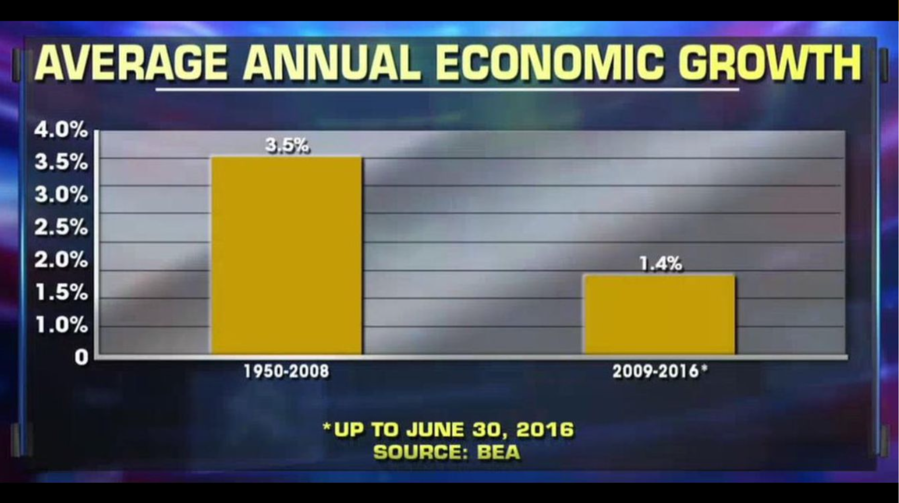
Source : Stephan Tracy, *How to lie with charts*

Quelques éléments d’analyse :
- Sens de l’échelle verticale
- Asymétrie des ensembles comparés
- Moyenne de moyenne ?

   .png)

### Analyse d'un jeu de données
   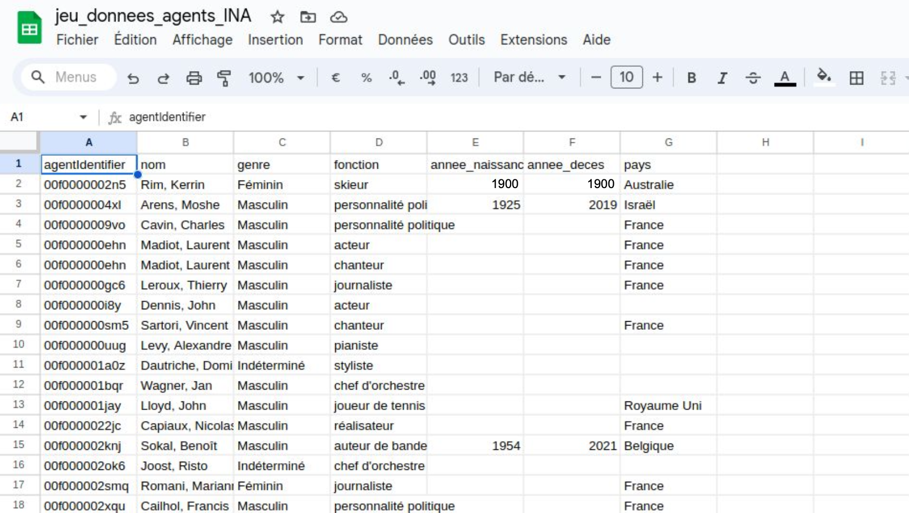

#### 1. **Données manquantes**
   - **Colonnes affectées** : Les colonnes `annee_naissanc`, `annee_deces`, et `pays` présentent des valeurs manquantes.
     - **Année de naissance** : Il y a plusieurs lignes où la date de naissance n'est pas renseignée.
     - **Année de décès** : De même, plusieurs valeurs sont manquantes.
     - **Pays** : Certains individus n'ont pas de pays renseigné.
   
   - **Action recommandée** :
     - Remplacer les données manquantes par des valeurs par défaut (par exemple "Inconnu") ou imputer les dates en fonction de sources externes, si cela est possible.

#### 2. **Exactitude des données**
   - **Doublons dans les enregistrements** : On remarque un doublon dans les lignes concernant "Laurent Madiot" (lignes 5 et 6). Est-ce que c'est le même individu ?
     - **Action recommandée** : Supprimer les doublons ou les fusionner, si nécessaire.
   
   - **Années incohérentes** : 
     - Exemple : Pour "Kerrin Rim" (ligne 2), les années de naissance et décès semblent erronées ou incompréhensibles, car on a "1900" pour les deux. Cela est probablement incorrect.
     - **Action recommandée** : Vérifier et corriger ces informations.

#### 3. **Cohérence des formats**
   - **Typage des colonnes** : Il est important de vérifier que les colonnes numériques comme `annee_naissanc` et `annee_deces` soient bien au format numérique.
   - **Colonnes catégorielles** : La colonne "genre" présente des catégories comme "Féminin", "Masculin", et "Indéterminé". Assurez-vous que ces valeurs soient cohérentes et standardisées (pas d'espace en trop, pas de majuscules imprévues).

#### 4. **Valeurs aberrantes (Outliers)**
   - Déjà vu pour l'année 1900.
   
#### 5. **Pertinence des données**
   - **Colonnes redondantes** : À première vue, toutes les colonnes semblent pertinentes, mais il serait bon de vérifier si certaines données comme le `agentIdentifier` sont utilisées pour des opérations spécifiques. Si non, elles peuvent être ignorées pour simplifier l’analyse.

#### 6. **Normalisation et standardisation**
   - **Pays** : Les noms de pays comme "Royaume Uni" ou "France" sont mentionnés. Assurez-vous que ces noms soient normalisés (pas d'abréviations, usage uniforme de majuscules et minuscules).

Il existe des recommandations sur le **typage des données** :
   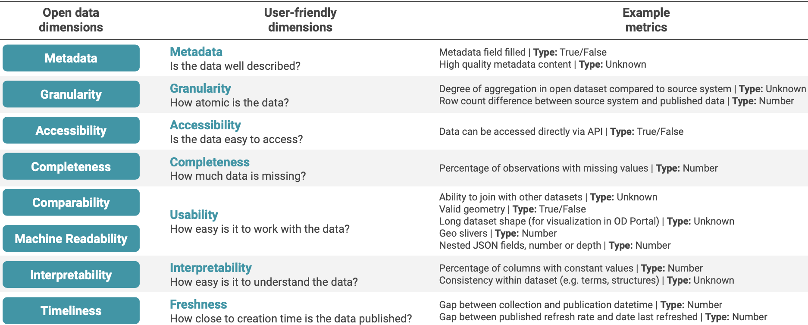
Plus en détails :
Présentation des indicateurs élaborés par le groupe de travail Toronto Open Data : https://docs.google.com/presentation/d/1yFaPN_aL4D8h__3kTQ9GAc970nkroQaY/edit#slide=id.p1

Pour rappel, les données doivent être dans un **fichier csv** (Comma-separated values).

## Type de données et représentation
**Qualitatives**
- Nominales : Désigne des catégories sans ordre intrinsèque
- Ordinales : Désigne des catégories ordonnées

**Quantitatives**
- Discrètes : Désigne une valeur numérique sur une échelle graduée
- Continues : Désigne une valeur numérique sur une échelle infinie et décimale

**Géographiques**  
**Calendaires**

#### En tableau :
   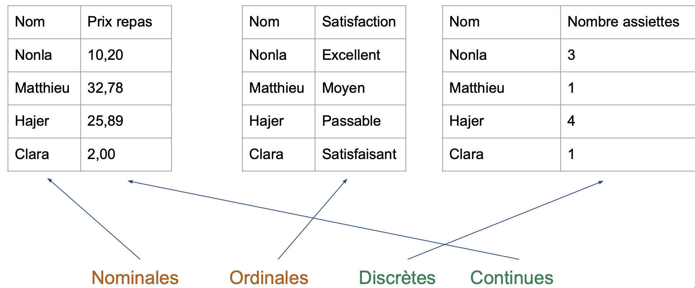

#### Quelle représentation?
   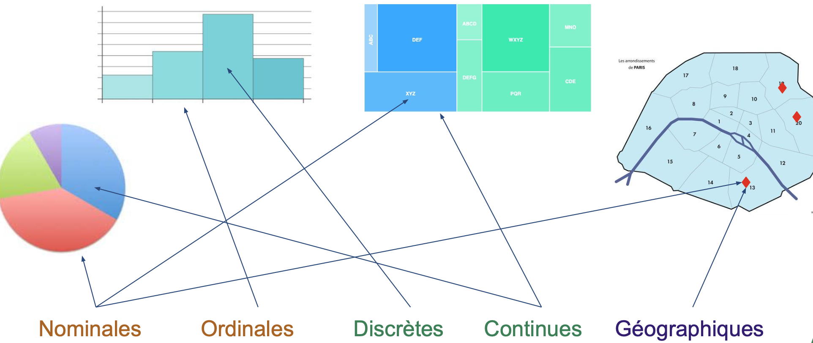

#### Une bonne boîte à outils :
https://en.wikipedia.org/wiki/Data_and_information_visualization#Techniques

## RAWGraphs
Un outil simple pour commencer. Quelle visualisation choisir ? 

https://www.rawgraphs.io

**Exemple avec Fifa player**  
Faire avec Radar Chart

### Exercices
Trouvez la bonne visualisation :
- president : gantt
- dialogue : arc diagram
- temperature : contour plot
- lettres : matrix
- crimes : alluvial
- fleur : convex

## Khartis
Khartis est une application en ligne développée par **Sciences Po**, dédiée à la création de **cartes choroplèthes** (cartes thématiques où les régions sont colorées en fonction d’une valeur). C’est un outil très simple d’utilisation, conçu pour les non-experts en géomatique.
Avantages :
- Pas besoin de connaissances en programmation.
- Interface intuitive et en français.
- Permet de créer rapidement des cartes thématiques à partir de fichiers CSV ou Excel.

### Démonstration
Faire un exemple avec la température moyenne en France (fichier département.csv)

### Exercice
À partir du fichier chomage-usa.csv, essayez de reproduire cette carte. 
   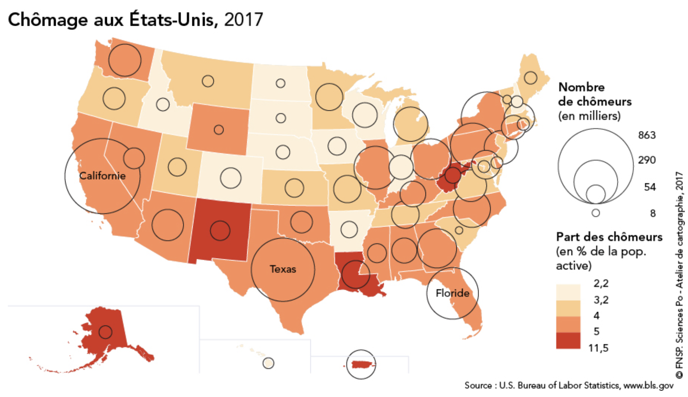

Maintenant, essayez de trouver la meilleure carte possible à partir du fichier armes.csv.
   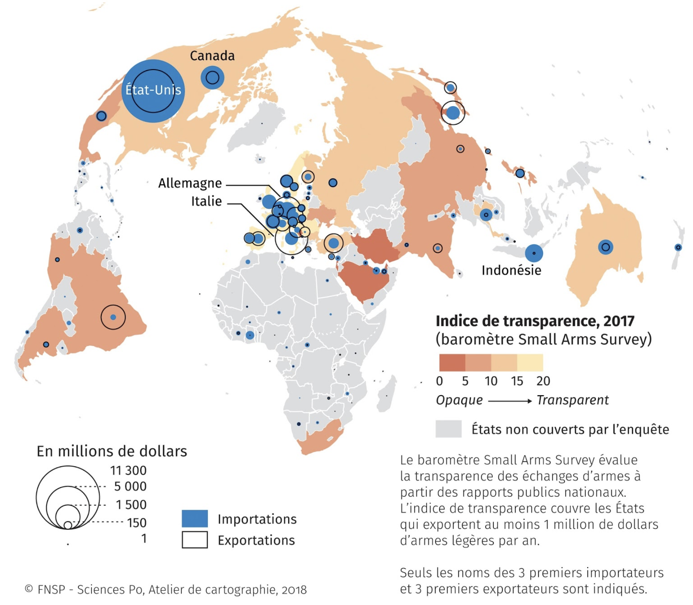
